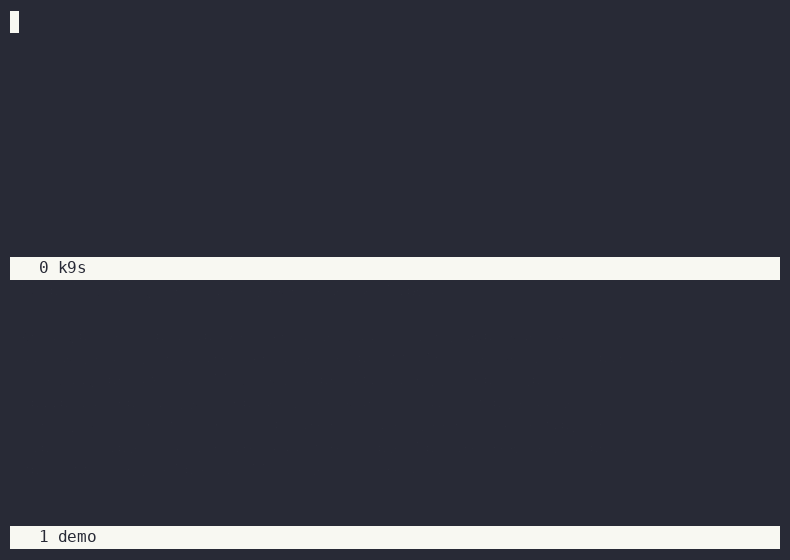
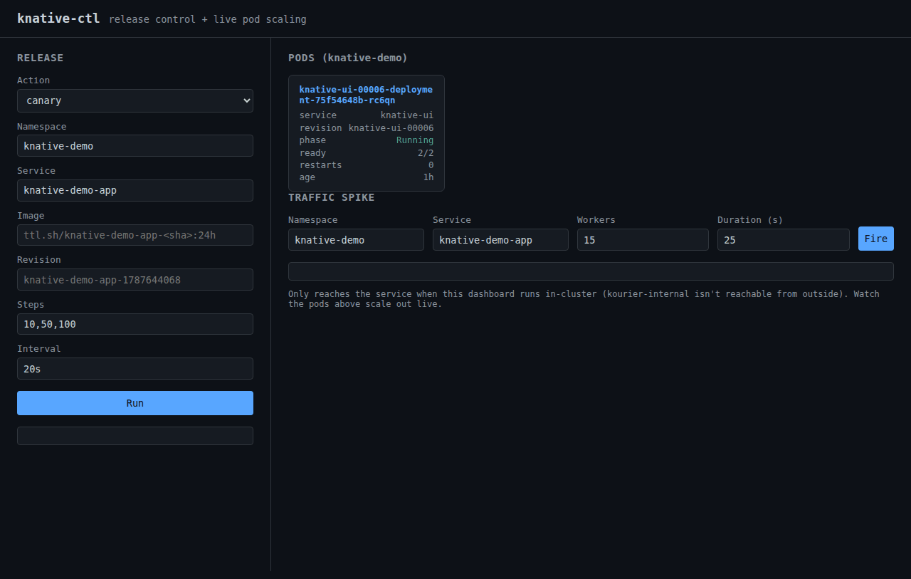

# knative-ctl

A Knative Serving + Kourier proof-of-concept: a standalone Go CLI for
platform install/uninstall and canary/blue-green release automation
(built directly on `ksvc.spec.traffic` revision splitting, no extra
controller like Argo Rollouts/Flagger required), a minimal Spring Boot demo
app, and GitHub Actions workflows that build the app and drive the release
flows.

## Why Knative

Everything below is demonstrated in this repo, not asserted — see the
demos and manifests linked throughout.

- **Scale-to-zero without dropping the request that woke it up.** At
  `min-scale: 0`, Knative's activator sits directly in the request path:
  it receives the first request itself, buffers it, and triggers the
  cold start — the request that caused the scale-up is the one that gets
  served, not lost or retried against nothing. See
  [Demo 1](#demo-1-traffic-spike-and-autoscaling): idle at 0 replicas,
  burst of traffic, scale-out, then back to 0 once load stops, no manual
  intervention.
- **Canary and blue-green are built in, not bolted on.** No Argo
  Rollouts, no Flagger, no service mesh required — traffic splitting
  between revisions is a native field (`spec.traffic`) on the `Service`
  object itself. `knative-ctl` (this repo) automates both flows on top
  of plain `kubectl patch` calls, no additional controller running in
  the cluster. See [Demo 2](#demo-2-canary-and-blue-green).
- **Every deploy is an immutable, independently-addressable Revision.**
  Nothing gets overwritten — each rollout creates a new `Revision`
  object, reachable on its own tagged URL even while receiving 0%
  public traffic. Rollback is a single traffic patch back to any prior
  revision's name, not a redeploy (`knative-ctl rollback`).
- **Runs real, unmodified workloads.** No proprietary SDK, no
  language-specific runtime lock-in. This PoC proves it two ways: a
  minimal static Go binary and a full Spring Boot JVM app, same
  platform, same CLI, same YAML shape — just a container in both cases.
- **Close to a standard Kubernetes PodSpec, not a different API to
  learn.** `containers` (resources, env, probes, volumeMounts),
  `volumes`, `serviceAccountName`, `imagePullSecrets`, and — behind
  widely-enabled feature flags — `nodeSelector`/`affinity`/`tolerations`
  all carry straight into `spec.template.spec`. Compare
  `examples/normal/service.yaml` to any plain Deployment pod template:
  the diff is the `Service`/`Route` wrapper and the autoscaling
  annotations, not the workload spec itself. Migrating an existing
  container onto Knative is usually a small diff, not a rewrite.
- **Lightweight by default.** This whole PoC — platform, autoscaler,
  ingress, and two demo apps — runs on a 2-CPU/3.7GB box using Kourier
  instead of a full Istio service mesh for ingress.

Layout:

```
main.go, release.go    knative-ctl CLI source
examples/              normal / canary / bluegreen manifests, run against them
app/                    the Spring Boot demo service
demo/                   recorded GIF demos embedded above, and the scripts that made them
infra/ingress/          nginx-ingress + MetalLB + cert-manager manifests, see below
infra/tailscale/        external access setup, no cloud NLB required
infra/observability/    Zipkin + the tracing config for Serving, Kourier and Eventing
eventing-demo/          GitHub webhook -> Broker/Trigger fan-out
ui/                      dashboard: trigger releases, watch pods scale live -- local or in-cluster
.github/workflows/     build-app.yml (build+push), deploy.yml (release flows),
                       test-deploy-flows.yml (e2e test of the release flows)
```

The demo runs in the `knative-demo` namespace (`kubectl create namespace
knative-demo`).

## Demos

Demos 1 and 2 are two-pane terminal recordings: `k9s` watching
`knative-demo` (top) beside a scripted `bash` run driving the actual
commands (bottom), via `asciinema` + `agg` inside a `screen` split.
Demo 3 is the dashboard (a browser page, not a terminal) — see
`demo/3-dashboard/README.md` for how that one's actually captured.

### Demo 1: traffic spike and autoscaling


Service idle at 0 replicas, a burst of concurrent requests triggers
scale-out through the activator (`autoscaling.knative.dev/min-scale: "0"`,
see the annotations above), then it scales back down to zero once the
load stops. Re-run it yourself with:

```
asciinema rec demo/1-traffic-spike/demo.cast -c "screen -c demo/1-traffic-spike/screenrc"
agg demo/1-traffic-spike/demo.cast demo/1-traffic-spike/demo.gif
```

### Demo 2: canary and blue-green



A scripted run of `knative-ctl canary` then `knative-ctl bluegreen`
against the demo service. Re-run it yourself with:

```
asciinema rec demo/2-canary-bluegreen/demo.cast -c "screen -c demo/2-canary-bluegreen/screenrc"
agg demo/2-canary-bluegreen/demo.cast demo/2-canary-bluegreen/demo.gif
```

### Demo 3: dashboard



A canary release triggered from the [dashboard](ui/) UI, then a
traffic-spike simulation watched live in the Pods panel — a real 0→2
pod scale-out. See `demo/3-dashboard/README.md` for how this one's
captured (no terminal to record — a hand-rolled Chrome DevTools
Protocol driver instead).

## Build

```
go build -o knative-ctl .
```

## Platform lifecycle

Installs/uninstalls against the cluster the current kubeconfig points at,
by applying the upstream release manifests (defaults to `knative-v1.23.0`).
`all` covers `knative`, `kourier`, `metallb`, `cert-manager`, `ingress`
and `zipkin`, in dependency order. `eventing` is its own target and
never part of `all` — it's the heaviest piece by far (see
[`eventing-demo/`](eventing-demo/)):

```
knative-ctl install   knative|kourier|eventing|zipkin|metallb|cert-manager|ingress|all [--version knative-vX.Y.Z]
knative-ctl uninstall knative|kourier|eventing|zipkin|metallb|cert-manager|ingress|all [--version knative-vX.Y.Z]
```

`--version` only applies to `knative`/`kourier`/`eventing` — the rest
are pinned to specific releases in `main.go`, not user-selectable.
`install kourier` also configures Kourier as the default Knative ingress
class and keeps its Service `ClusterIP`-only (see below). Applies are retried once on transient failure (CRD establishment can
briefly time out under load).

## North-south: nginx-ingress + MetalLB + Kourier

Verified working end-to-end. `knative-ctl install all` includes this
now, or install pieces individually the same way as `knative`/`kourier`
above:

```
knative-ctl install kourier
knative-ctl install metallb
knative-ctl install cert-manager
knative-ctl install ingress
```

Kourier is never an external `LoadBalancer`: `install kourier` switches
its Service to `ClusterIP` straight after applying the upstream manifest.
East-west traffic goes directly to `kourier-internal`, and `nginx-ingress`
is the single external entry point in front of that same Service, reached
via a real LAN IP from MetalLB rather than the node's own address:

```
        client (LAN)
             │
             │ curl -H "Host: <svc>.<ns>.svc.cluster.local" http://192.168.0.200/
             ▼
   ┌───────────────────────┐
   │  MetalLB (L2 / ARP)    │  pool 192.168.0.200-210, hands out .200
   └───────────┬────────────┘
               ▼
   ┌───────────────────────┐
   │  ingress-nginx          │  north-south entry point (LoadBalancer :80/:443)
   └───────────┬────────────┘
               │ Ingress in kourier-system, host *.knative-demo.svc.
               │ cluster.local (same hosts the TLS cert authenticates
               │ for) -- routes straight to kourier-internal
               ▼
   ┌───────────────────────┐
   │  kourier-internal        │  ClusterIP — also the direct entry point
   │  (3scale-kourier-gateway)│  for east-west (pod-to-pod) traffic,
   └───────────┬────────────┘  which never touches nginx-ingress at all
               ▼
   ┌───────────────────────┐
   │  Knative Revision        │  activator sits here at scale=0
   └───────────────────────┘
```

Kourier is the only thing doing actual Knative routing (host matching,
traffic splitting) in either direction — `nginx-ingress` is purely the
north-south entry point, not a second routing plane: one `Ingress`
object declares the route to Kourier for the hosts actually being
served, Kourier does everything past that. The controller's own
`--default-backend-service=kourier-system/kourier-internal` flag stays
too, as a fallback for anything that somehow doesn't match the
Ingress's host — the Ingress is the primary, declared route.
`cert-manager` issues a self-signed default TLS cert
(`--default-ssl-certificate`, one cert for any HTTPS connection since
there's no per-host SNI config yet) — no shared root, so clients need
`-k`/`--insecure` or equivalent.

Manifests and the cluster-level setup steps for this are in
[`infra/ingress/`](infra/ingress/).

### External access without a cloud NLB

No cloud budget for a real external load balancer, so
[`infra/tailscale/`](infra/tailscale/) uses Tailscale as a substitute:
`tailscaled` joins this node to an existing tailnet, and `tailscale
serve` proxies a standard HTTPS endpoint (a real, trusted
Tailscale-issued cert, no `-k` needed) straight to `nginx-ingress`'s
local NodePort — private, authenticated mesh, not public internet
exposure.

```
   phone (different network) ── tailnet ──▶ node's tailscale0 ── tailscale serve ──▶ nginx-ingress NodePort
                                                                          │
                                                                          └── same passthrough → kourier-internal → Revision path above
```

Verified from a phone on a separate network entirely (cellular, not
this LAN):

```
curl -H "Host: knative-demo-app.knative-demo.svc.cluster.local" https://blanketops.tailf8145.ts.net/
```

returned `200` with the real app response.

## Tracing: Zipkin

`knative-ctl install zipkin` (part of `install all`) deploys Zipkin and
points Serving, Kourier's gateway and — if installed — Eventing at it,
so every request and every event shows up as one trace across all the
hops it took:

```
kubectl port-forward -n observability svc/zipkin 9411:9411   # http://localhost:9411
knative-ctl trace-sampling 0.1                               # default is 1 (every request)
```

What's in a trace, how to watch traffic live, and why this isn't the
stock Zipkin image are in [`infra/observability/`](infra/observability/).

## Example manifests

Each folder is a self-contained, directly `kubectl apply`-able sequence for
one deployment pattern. All three carry the same autoscaling annotations,
which are what make scale-to-zero and on-demand scale-up through the
activator work (see inline comments in the manifests for what each one
does):

- `autoscaling.knative.dev/class: kpa.autoscaling.knative.dev` — the
  Knative Pod Autoscaler; unlike the `hpa` class it can scale to 0.
- `autoscaling.knative.dev/min-scale: "0"` — allows scaling to zero. At 0
  replicas the activator sits in the request path, buffers the incoming
  request, and triggers a cold-start scale-up on demand.
- `autoscaling.knative.dev/max-scale: "3"` — capped low deliberately for
  small/resource-constrained clusters.
- `autoscaling.knative.dev/target: "10"` and
  `target-utilization-percentage: "70"` — scale-out trigger (concurrent
  in-flight requests per pod, with headroom).
- `autoscaling.knative.dev/scale-down-delay: "30s"` — hysteresis so a
  brief lull doesn't immediately scale back down.

All three deploy the app in `app/` (see below) into the `knative-demo`
namespace, currently pinned to a `ttl.sh/knative-demo-app-<sha>:24h`
build rather than this repo's own `ghcr.io/ntlaletsi70/knative-demo-app`
image — see the CI workflows section for why, and swap back to the
`ghcr.io` reference once that's resolved.

**`examples/normal/`** — a plain single-revision service, 100% traffic by
default (`spec.traffic` omitted):

```
kubectl apply -f examples/normal/service.yaml
```

**`examples/canary/`** — three-step progressive traffic shift, run in
order (or drive the same flow with `knative-ctl canary` instead of
applying by hand):

```
kubectl apply -f examples/canary/01-stable.yaml
kubectl apply -f examples/canary/02-canary-split.yaml   # 80/20 split
kubectl apply -f examples/canary/03-promote.yaml        # 100% to v2, v1 kept at 0%
```

**`examples/bluegreen/`** — deploy dark, then cut over atomically (or use
`knative-ctl bluegreen`):

```
kubectl apply -f examples/bluegreen/01-blue.yaml
kubectl apply -f examples/bluegreen/02-green-cutover.yaml
```

## Demo application

`app/` is a minimal Spring Boot service (`spring-boot-starter-web`, one
`GET /` endpoint returning a `TARGET` env var like the earlier Go demo
did). `app/Dockerfile` is a two-stage Maven build producing a JRE-Alpine
image, with the JVM tuned for a small node (`-Xmx192m`, serial GC, reduced
JIT tiering — see the Dockerfile comment). Because a JVM needs meaningfully
more than the earlier Go demo, the example manifests request 100m CPU /
256Mi memory per revision (limit 500m / 384Mi) instead of the Go demo's
50m / 32Mi.

## CI workflows

**`build-app.yml`** — builds `app/` and pushes to
`ghcr.io/<owner>/knative-demo-app:latest`/`:<sha>` on every push to
`main` touching `app/**`, or via manual dispatch. Runs on GitHub's own
hosted runner, so it needs nothing from the local machine. It also
pushes to `ttl.sh/knative-demo-app-<sha>:24h` — the `ghcr.io` package
was created back when this repo was private and inherited that access
(a known GHCR gotcha: a package's "inherit access from source repo"
setting is sticky and doesn't re-sync just because the repo's own
visibility changes later, even with the package's own visibility set to
public), so it's still not anonymously pullable even now that the repo
is public. `ttl.sh` needs no auth for push or pull at all, so the example
manifests are pinned to it for now. It's anonymous/ephemeral and the tag
expires 24h after build — re-run this workflow to refresh it, and swap
`examples/*.yaml` back to the `ghcr.io` reference once the package's own
access setting is fixed.

**`deploy.yml`** — manual-dispatch workflow that runs one of `normal`,
`canary`, `bluegreen`, or `rollback` via `knative-ctl` against a cluster.
Requires a `KUBECONFIG` repository secret (base64-encoded kubeconfig)
pointing at a cluster the GitHub-hosted runner can actually reach.
**It cannot reach a local/home cluster with no public ingress** — for
that case, run `knative-ctl` locally exactly as this workflow does
internally.

**`test-deploy-flows.yml`** — a real end-to-end test of the release flows
`deploy.yml` exposes, since `deploy.yml` itself can't be exercised
against a cluster this project doesn't have public access to. Spins up a
disposable `kind` cluster on the runner, installs Knative + Kourier via
`knative-ctl install all`, then runs `canary`, `bluegreen`, and
`rollback` with the exact same command shape `deploy.yml` uses (flags
after the positional `<service> <image>` args) — so it doubles as a
regression test for a real bug this repo shipped and fixed (flags in
that position were silently dropped; see the git history on `release.go`
for the full story). Runs on every push touching the CLI source or
either workflow file, or via manual dispatch.

## Release flows

Operate on a Knative Service that's already deployed.

**Canary** — shift traffic to a new revision in steps, tagging both
revisions (`stable`/`canary`) for individual testability along the way:

```
knative-ctl canary <service> <image> [--steps 10,50,100] [--interval 20s] [--namespace knative-demo]
```

**Blue-green** — deploy the new revision dark (0% traffic), wait for it to
become Ready, then cut over atomically. The previous revision is retained
at 0% for instant rollback:

```
knative-ctl bluegreen <service> <image> [--namespace knative-demo]
```

**Rollback** — flip 100% traffic to any named revision:

```
knative-ctl rollback <service> <revision> [--namespace knative-demo]
```

## Dashboard

All three release flows above, plus a live view of pods scaling
up/down as they happen, from a web UI instead of the CLI. See
[`ui/`](ui/) — runs locally:

```
go build -o knative-ui ./ui
./knative-ui   # http://127.0.0.1:8090
```

or in-cluster, reachable through the same north-south path as the demo
app:

```
kubectl apply -f ui/rbac.yaml
kubectl apply -f ui/service.yaml
```

It shells out to the `knative-ctl` binary and streams its output —
same release logic, one place, not reimplemented. No authentication on
either path — see `ui/README.md` before exposing it beyond a private
LAN/tailnet.
